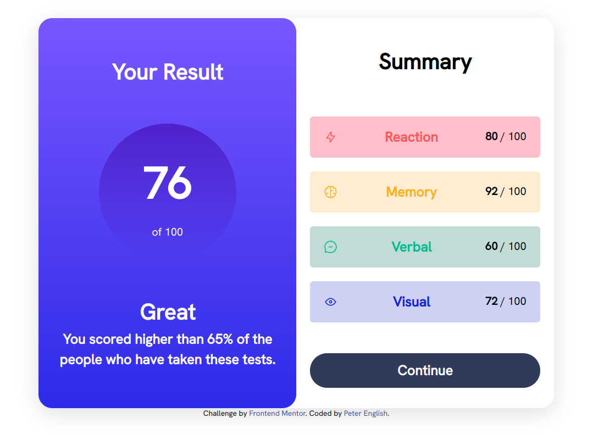

# Frontend Mentor - Results summary component solution

This is a solution to the [Results summary component challenge on Frontend Mentor](https://www.frontendmentor.io/challenges/results-summary-component-CE_K6s0maV). Frontend Mentor challenges help you improve your coding skills by building realistic projects. 

## Table of contents

- [Overview](#overview)
  - [The challenge](#the-challenge)
  - [Screenshot](#screenshot)
  - [Links](#links)
- [My process](#my-process)
  - [Built with](#built-with)
  - [What I learned](#what-i-learned)
  - [Continued development](#continued-development)
- [Author](#author)


## Overview

### The challenge

Users should be able to:

- View the optimal layout for the interface depending on their device's screen size
- See hover and focus states for all interactive elements on the page

### Screenshot




### Links

- Solution URL: [Add solution URL here](https://github.com/PeterEnglish/results-summary-component)
- Live Site URL: [Add live site URL here](https://peterenglish.github.io/results-summary-component/)

## My process

### Built with

- Semantic HTML5 markup
- CSS custom properties
- Flexbox


### What I learned

The first thing I learned was about variable fonts. Variable fonts are a way of storing the variation of multiple fonts into a single font file. I learned how to use variable fonts, utilising the 'Grotesk' variable font in this project.

The next thing I learned was about block versus inline block versus inline.
  -'block' elements take up the width of their parent and create a new line after them
  -'inline' elements only take up their own width and don't create a new line
  -'inline-block' shares characteristics of the pervious two.

I also learned about gradients, for example:
```css
.background{
background: linear-gradient(to bottom, hsla(256, 72%, 46%, 1), hsla(241, 72%, 46%, 0));
}
```
This creates a gradient for the background of the element going from top to bottom.

As a final note on what I learned, I also became aware of how useful it was to group elements into containers in my css, and to then be able to position the overall layout of multiple elements at the same time.


### Continued development

I'd like to see if there is a more structured way of naming elements in your css. For instance, would there be a clash if you had two 'primary-button' classes being applied from different stylesheets? How would you remedy this problem? Would you create a 'form-primary-button' class? Or a 'checkout-form-primary-button' class? How far do you go in specificity?

I also intend on using breakpoints more often, and using a 'mobile-first' approach to my development, whereby I start with the mobile view of a project, then adjust this layout to be desktop friendly, instead of the other way around.


## Author

- Frontend Mentor - [@PeterEnglish](https://www.frontendmentor.io/profile/PeterEnglish)

